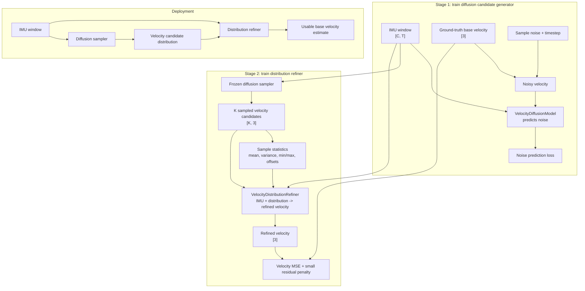

# IMU Velocity Diffusion

This branch trains a diffusion-assisted base-velocity estimator from IMU windows.

The deployed pipeline is:

1. **Diffusion candidate generator**: samples multiple plausible base velocities
   from an IMU window.
2. **Velocity distribution refiner**: uses the same IMU window plus the sampled
   velocity distribution to produce one usable velocity estimate.

The point is not to force the diffusion model to pick one answer. It proposes a
set of velocity hypotheses. The second network then aggregates and refines that
sampled distribution: it can use the sample mean as the likely velocity, sample
variance as uncertainty, multimodal structure as a cue that several motions are
plausible, and IMU features to reject inconsistent samples.

## Pipeline Diagram



## Data Format

The loader expects NPZ trajectory files. It searches recursively inside each
split folder, so category subfolders are fine.

```text
data/
  train/
    car/*.npz
    dog/*.npz
    drone/*.npz
    human/*.npz
  val/
    car/*.npz
    dog/*.npz
    drone/*.npz
    human/*.npz
  test/
    *.npz
```

Training/validation NPZ files should contain:

```text
imu       [T, 6]  IMU features
vel_body  [T, 3]  target base velocity in body frame
```

The test files only need `imu` for deployment inference. They do not need
`vel_body`.

The current checked layout is:

```text
train: 395 files, 2,046,950 windows
val:    80 files,   592,589 windows
test:   89 files, inference-only IMU trajectories
```

With the default config, each training sample is:

```text
imu      [6, 64]
velocity [3]
```

Keys, split names, stride, window size, and optional columns are configured in
`configs/default.yaml`. The loader indexes files lazily and keeps only a small
trajectory cache in memory, so it does not preload every NPZ at startup.

## Install

```bash
pip install -e ".[dev]"
```

## 1. Train Diffusion Candidates

The default config uses a small synthetic dataset so the code can be
smoke-tested before real data is present.

```bash
python train_diffusion.py --config configs/default.yaml
```

Outputs:

```text
runs/velocity_diffusion/diffusion_last.pt
runs/velocity_diffusion/diffusion_best.pt
```

The validation metric `candidate_min_rmse` measures the oracle error of the
closest sampled candidate.

## 2. Train Distribution Refiner

```bash
python train_policy.py \
  --config configs/default.yaml \
  --diffusion-checkpoint runs/velocity_diffusion/diffusion_best.pt
```

Outputs:

```text
runs/velocity_diffusion/refiner_last.pt
runs/velocity_diffusion/refiner_best.pt
```

During refiner training, the diffusion model is frozen. It samples candidate
velocities first, then the refiner receives:

```text
IMU window + [K, 3] candidate velocities + sample statistics
```

The refiner uses sample mean, variance, min/max range, per-candidate normalized
offsets, and IMU context. Its loss is final velocity MSE plus a small residual
penalty, so the model learns to convert the distribution into one usable
velocity estimate rather than merely picking a single candidate.

## 3. Run Deployment Inference

```bash
python infer.py \
  --config configs/default.yaml \
  --diffusion-checkpoint runs/velocity_diffusion/diffusion_best.pt \
  --refiner-checkpoint runs/velocity_diffusion/refiner_best.pt \
  --input-npz path/to/trajectory.npz \
  --output-npz runs/velocity_diffusion/predictions.npz
```

The output NPZ contains:

```text
window_starts
candidate_velocities  [N, K, 3]
candidate_weights     [N, K]
refined_velocity      [N, 3]
```

## Data Configuration

The repository is already configured for the current `data/` folder:

```yaml
data:
  synthetic: false
  root: ./data
  imu_key: imu
  velocity_key: vel_body
  window_size: 64
  stride: 8
```

If your NPZ arrays use different names or include extra channels, change
`imu_key`, `velocity_key`, `imu_columns`, and `velocity_columns`.

For real training, increase:

```yaml
diffusion:
  steps: 50
policy:
  num_candidates: 32
train:
  epochs: 100
```
