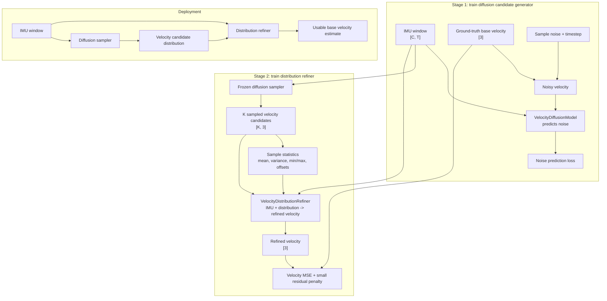

# IMU Velocity Diffusion

This branch trains a diffusion-assisted base-velocity estimator from IMU windows.

The deployed pipeline is:

1. **Diffusion candidate generator**: samples multiple plausible base velocities
   from an IMU window.
2. **Velocity distribution refiner**: uses the same IMU window plus the sampled
   velocity distribution to produce one usable velocity estimate.

The point is not to force the diffusion model to pick one answer. It proposes a
set of velocity hypotheses. The second network then aggregates and refines that
sampled distribution: it can use the sample mean as the likely velocity, sample
variance as uncertainty, multimodal structure as a cue that several motions are
plausible, and IMU features to reject inconsistent samples.

## Pipeline Diagram



## Data Format

The loader expects NPZ trajectory files. It searches recursively inside each
split folder, so category subfolders are fine.

```text
data/
  train/
    car/*.npz
    dog/*.npz
    drone/*.npz
    human/*.npz
  val/
    car/*.npz
    dog/*.npz
    drone/*.npz
    human/*.npz
  test/
    *.npz
```

Training/validation NPZ files should contain:

```text
imu       [T, 6]  IMU features
vel_body  [T, 3]  target base velocity in body frame
```

The test files only need `imu` for deployment inference. They do not need
`vel_body`.

The current checked layout is:

```text
train: 395 files, 2,046,950 windows
val:    80 files,   592,589 windows
test:   89 files, inference-only IMU trajectories
```

With the default config, each training sample is:

```text
imu      [6, 100]
velocity [3]
```

Keys, split names, stride, window size, and optional columns are configured in
`configs/default.yaml`. The default diffusion window is one actual prediction
window: 1 second of 200 Hz source IMU, non-overlapping, downsampled to 100 Hz
before it is fed to the diffusion model. The downstream actual model may use a
different IMU input rate, such as 40 Hz, because it consumes the diffusion
model's velocity candidates rather than the diffusion IMU tensor. The loader
indexes files lazily and keeps only a small trajectory cache in memory, so it
does not preload every NPZ at startup.

## Install

```bash
pip install -e ".[dev]"
```

## 1. Train Diffusion Candidates

The default config uses a small synthetic dataset so the code can be
smoke-tested before real data is present.

```bash
python train_diffusion.py --config configs/default.yaml
```

Outputs:

```text
runs/velocity_diffusion/diffusion_last.pt
runs/velocity_diffusion/diffusion_best.pt
```

The validation metric `candidate_min_rmse` measures the oracle error of the
closest sampled candidate.

## 2. Train Distribution Refiner

```bash
python train_policy.py \
  --config configs/default.yaml \
  --diffusion-checkpoint runs/velocity_diffusion/diffusion_best.pt
```

Outputs:

```text
runs/velocity_diffusion/refiner_last.pt
runs/velocity_diffusion/refiner_best.pt
```

During refiner training, the diffusion model is frozen. It samples candidate
velocities first, then the refiner receives:

```text
IMU window [6, 100] + [K, 3] candidate average velocities + sample statistics
```

Each candidate is a suggested body-frame average velocity for the same actual
1-second source window used as the training target. Downstream 40 Hz training
can consume these candidates because the frequency-specific diffusion input has
already been reduced to velocity suggestions. `train_policy.py` checks that the
current config and diffusion checkpoint agree on this velocity contract before
feeding candidates into refiner training.

The refiner uses sample mean, variance, min/max range, per-candidate normalized
offsets, and IMU context. Its loss is final velocity MSE plus a small residual
penalty, so the model learns to convert the distribution into one usable
velocity estimate rather than merely picking a single candidate.

## 3. Run Deployment Inference

```bash
python infer.py \
  --config configs/default.yaml \
  --diffusion-checkpoint runs/velocity_diffusion/diffusion_best.pt \
  --refiner-checkpoint runs/velocity_diffusion/refiner_best.pt \
  --input-npz path/to/trajectory.npz \
  --output-npz runs/velocity_diffusion/predictions.npz
```

The output NPZ contains:

```text
window_starts
candidate_velocities  [N, K, 3]  average body-velocity suggestions
candidate_weights     [N, K]
refined_velocity      [N, 3]
candidate_semantics
source_window_size
source_stride
diffusion_imu_downsample_step
diffusion_model_window_size
```

## 4. Write a Submission CSV

Use `starter/diffusion_refiner_submission.py` to run the trained diffusion +
refiner stack over the official test windows and write the Kaggle CSV:

```bash
python starter/diffusion_refiner_submission.py \
  --split test \
  --config configs/default.yaml \
  --diffusion-checkpoint runs/velocity_diffusion/diffusion_best.pt \
  --refiner-checkpoint runs/velocity_diffusion/refiner_best.pt \
  --out submission_diffusion_refiner.csv
```

The output CSV has the required columns:

```text
window_id,vx,vy,vz
```

For Kaggle, the `window_id` values must match the official
`index/test_windows.csv` or `sample_submission.csv` exactly. By default, the
script looks for `data/index/test_windows.csv`, and if `--split-root` is passed
it also checks for a sibling `index/test_windows.csv` beside that split folder.
For unusual layouts, pass both paths explicitly:

```bash
python starter/diffusion_refiner_submission.py \
  --split test \
  --split-root /path/to/test \
  --windows /path/to/index/test_windows.csv \
  --config configs/default.yaml \
  --diffusion-checkpoint runs/velocity_diffusion/diffusion_best.pt \
  --refiner-checkpoint runs/velocity_diffusion/refiner_best.pt \
  --out submission_diffusion_refiner.csv
```

If no official windows CSV is present, the script stops instead of generating
local placeholder `window_id` values. Those generated IDs are only for smoke
tests and can be enabled with `--allow-generated-window-ids`.

For a validation-format CSV before submitting, use `--split val` and write to a
separate output file such as `submission_diffusion_refiner_val.csv`.

## 5. Run Evaluation and Trajectory Reconstruction

There are two evaluation paths in this repo.

To re-run validation for a trained diffusion checkpoint:

```bash
python train_diffusion.py \
  --config configs/default.yaml \
  --resume-from runs/velocity_diffusion/diffusion_best.pt \
  --eval-only
```

This prints validation noise loss, candidate oracle RMSE, per-platform candidate
metrics when platform labels are present, and the number of evaluated samples.

To reconstruct full trajectories and compute ATE/RTE-style trajectory metrics,
use the foundation-model evaluator:

```bash
python main_net.py \
  --config config/datasets/tartanimu/tartan_imu_dataset.yaml \
  --resume_from path/to/checkpoint.pt
```

Before running this command, make sure the evaluation config points at the
dataset and output folders you want:

```yaml
data:
  dataset: AirLab
  data_path:
    car: ../dataset/tartanimu_data/car/2
    drone: ../dataset/tartanimu_data/drone/drone_dataset_uzh_euroc_subt
    dog: ../dataset/tartanimu_data/dog/1+eth
    human: ../dataset/tartanimu_data/human/1

train:
  use_multi_gpu: false

test:
  out_dir: ../exp_result/tartan_imu_dataset

schemes:
  train: false
  test: true
```

`--resume_from` is the checkpoint loaded for testing. If it is omitted,
`main_net.py` loads the latest checkpoint under
`train.out_dir/checkpoints/`.

Trajectory reconstruction integrates the model's predicted velocities into
positions in `tartan_imu/evaluation/postprocess.py`, then segments each
trajectory for local drift-corrected metrics. Outputs are written under
`test.out_dir/<motion_type><split>/<trajectory_name>/`, including:

```text
trajectory.txt                  full reconstructed trajectory
est_pose_<epoch>.txt            predicted positions
gt_pose_<epoch>.txt             ground-truth positions
metrics.json                    per-trajectory metrics
segment_metrics_summary.json    per-segment metrics
segment_*/trajectory.txt        segment-level reconstructed trajectories
```

`trajectory.txt` stores comma-separated columns:

```text
timestamp, pred_x, pred_y, pred_z, gt_x, gt_y, gt_z, cov_x, cov_y, cov_z
```

At the run level, the evaluator also writes summary CSVs such as
`overall_summary.csv`, `trajectory_metrics.csv`, `segment_metrics.csv`, and
`performance_comparison.csv` in `test.out_dir`.

## Data Configuration

The repository is already configured for the current `data/` folder:

```yaml
data:
  synthetic: false
  root: ./data
  imu_key: imu
  velocity_key: vel_body
  imu_freq: 200.0
  sample_freq: 100
  window_size: 200
  stride: 200
```

If your NPZ arrays use different names or include extra channels, change
`imu_key`, `velocity_key`, `imu_columns`, and `velocity_columns`.

For real training, increase:

```yaml
diffusion:
  steps: 50
policy:
  num_candidates: 32
train:
  epochs: 100
```
